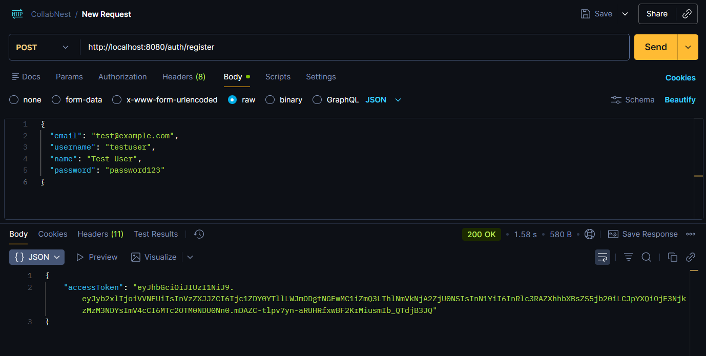
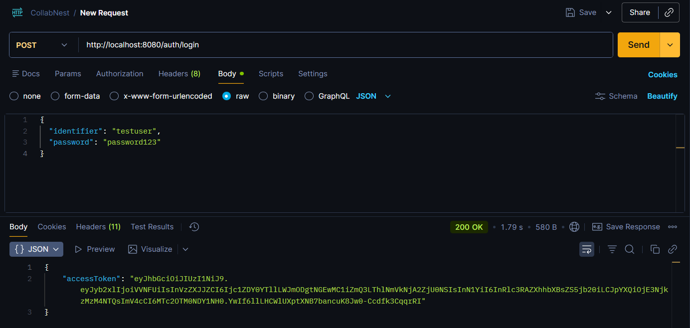
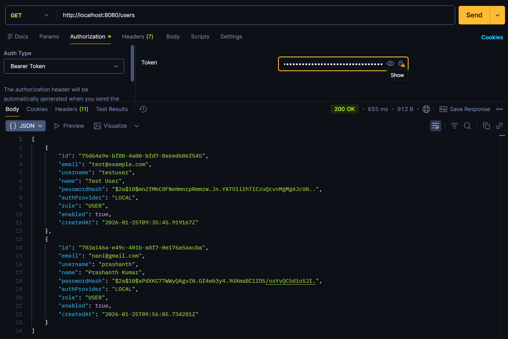
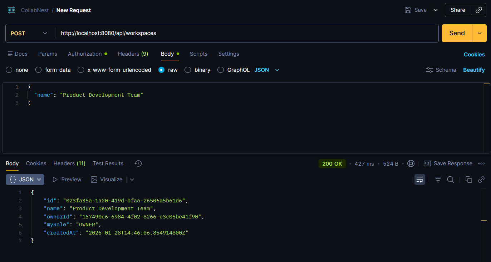
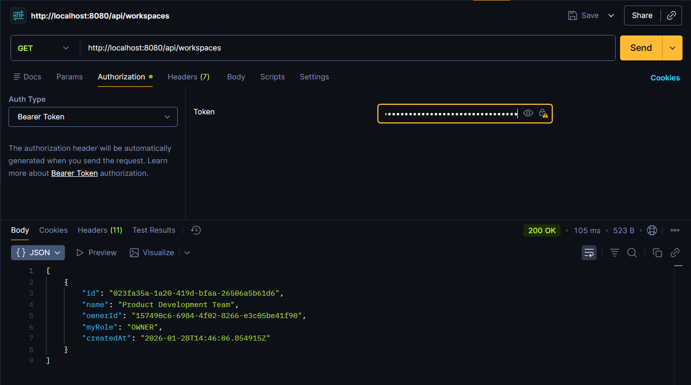
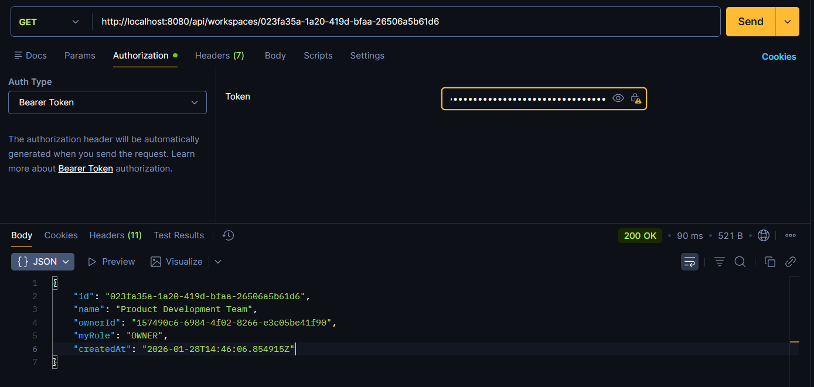
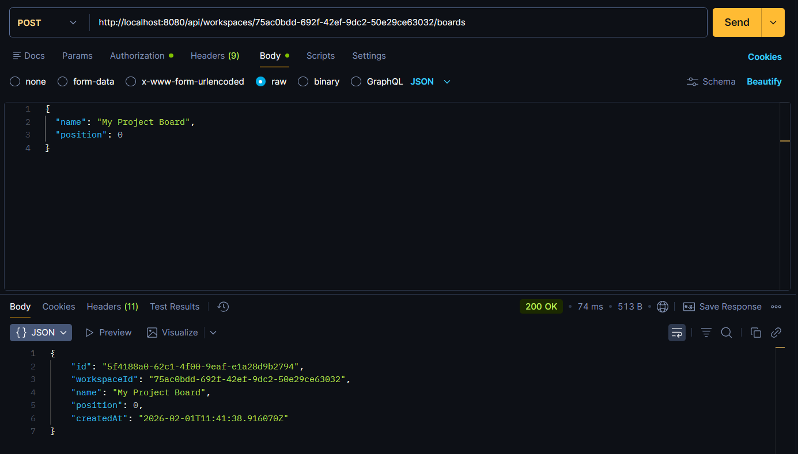
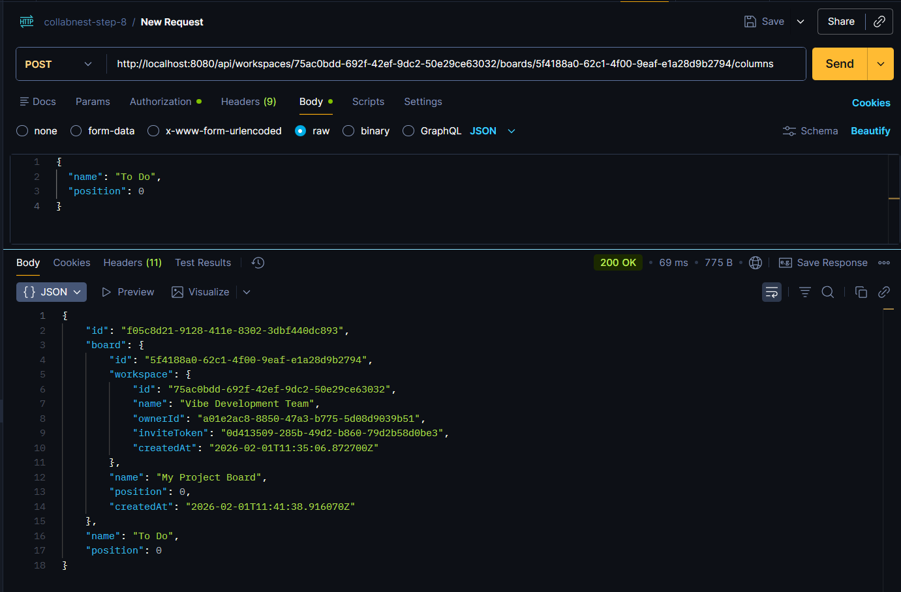
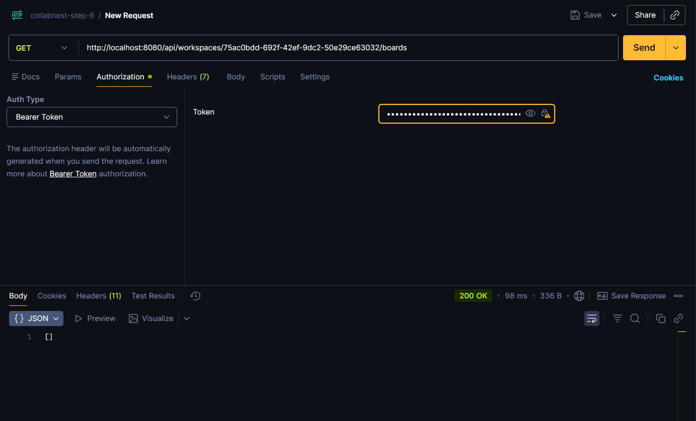

<div align="center">

# CollabNest

### Real-Time Collaborative Workspace & Project Management Platform

<p>
  <a href="https://openjdk.org/">
    
  </a>
  <a href="https://spring.io/projects/spring-boot">
    
  </a>
  <a href="https://nextjs.org/">
    
  </a>
  <a href="https://react.dev/">
    
  </a>
  <a href="https://www.postgresql.org/">
    
  </a>
  <a href="https://www.typescriptlang.org/">
    
  </a>
  <a href="LICENSE">
    
  </a>
</p>

<p>
  <strong>CollabNest</strong> unifies task management, Kanban boards, real-time messaging, document collaboration, and file sharing into a single role-based workspace — so your team can stop context-switching and start shipping.
</p>

</div>

---

<p align="left">
  <a href="https://collabnest.dev">
    <strong>👉 Live Demo 🌐</strong>
  </a>
</p>

---

## Table of Contents

- [Features](#-features)
- [Tech Stack](#-tech-stack)
- [Architecture](#-architecture)
- [Getting Started](#-getting-started)
  - [Prerequisites](#prerequisites)
  - [Database Setup](#1-database-setup)
  - [Backend Setup](#2-backend-setup)
  - [Frontend Setup](#3-frontend-setup)
  - [OAuth2 Configuration](#4-oauth2-configuration-optional)
- [Project Structure](#-project-structure)
- [API Reference](#-api-reference)
- [Database Schema](#-database-schema)
- [Screenshots](#-screenshots)
- [Contributing](#-contributing)
- [License](#-license)

---

## ✨ Features

### Workspaces

- Create and manage **multiple workspaces** for different teams or projects
- Invite members via email with **unique invite tokens**
- Role-based hierarchy — **Owner · Admin · Member · Viewer** — with granular permission control
- Real-time **activity feed** to track workspace events

### Kanban Boards

- Create multiple boards per workspace with **customizable columns** (To Do, In Progress, Review, Done, etc.)
- **Drag-and-drop** support for reordering tasks, columns, and boards
- Visual task organization with priority color coding

### Task Management

- Create tasks with title, description, **priority levels** (Low / Medium / High / Critical), and due dates
- **Assign** tasks to one or more team members
- Move tasks across columns and positions with real-time sync
- Define **task dependencies** to manage workflows and blockers
- **Link tasks to documents** for cross-referencing
- Contextual **comments** on tasks
- **Optimistic concurrency control** (versioned updates) to prevent conflicting edits

### Real-Time Chat

- **Workspace chat** — group messaging for the entire team
- **Direct messages** — private 1-on-1 conversations between members
- **Link messages** to specific tasks or documents for contextual discussions
- Paginated message history with infinite scroll
- Powered by **WebSocket** with STOMP protocol and SockJS fallback

### Documents & Comments

- Create and collaborate on rich documents within workspaces
- Threaded **comments** for feedback and discussions
- Bi-directional **document ↔ task linking** for traceability

### File Management

- Upload and manage files within workspaces
- Associate files with specific **tasks** or **documents**
- Organized file listing with metadata

### Notifications

- Real-time **push notifications** with read/unread tracking
- Mark individual or all notifications as read
- **Unread badge count** for instant visibility

### Activity Logs

- Comprehensive **audit trail** across all workspace actions
- Filter by user or view the full workspace feed
- Personal activity dashboard

### Authentication & Security

- **JWT-based** stateless authentication with refresh support
- **OAuth2 social login** with Google and GitHub
- Role-based access control at **global** and **workspace** levels
- Secure WebSocket connections with **JWT handshake authentication**

### Admin Dashboard

- Manage all users — view, update roles, enable/disable, or remove
- Platform-wide oversight and summary tools

### User Profiles

- View and update personal profile information
- Personalized dashboard with workspace overview

---

## 🛠 Tech Stack

<table>
<tr><th>Layer</th><th>Technology</th></tr>
<tr><td><strong>Backend</strong></td><td>Spring Boot 4.0.2 · Java 21 · Maven</td></tr>
<tr><td><strong>Frontend</strong></td><td>Next.js 16 · React 19 · TypeScript 5</td></tr>
<tr><td><strong>Database</strong></td><td>PostgreSQL · Flyway Migrations</td></tr>
<tr><td><strong>ORM</strong></td><td>Spring Data JPA · Hibernate</td></tr>
<tr><td><strong>Auth</strong></td><td>Spring Security · JWT (jjwt) · OAuth2 (Google, GitHub)</td></tr>
<tr><td><strong>Real-Time</strong></td><td>Spring WebSocket · STOMP · SockJS · @stomp/stompjs</td></tr>
<tr><td><strong>State Management</strong></td><td>Zustand · TanStack React Query</td></tr>
<tr><td><strong>UI / Styling</strong></td><td>Tailwind CSS 4 · Framer Motion · Lucide Icons</td></tr>
<tr><td><strong>Drag & Drop</strong></td><td>@hello-pangea/dnd</td></tr>
<tr><td><strong>Monitoring</strong></td><td>Spring Actuator</td></tr>
<tr><td><strong>Dev Tools</strong></td><td>Lombok · Spring DevTools · ESLint</td></tr>
</table>

---

## 🏗 Architecture

```
┌─────────────────────────────────────────────────────────────┐
│                        Client (Browser)                     │
│              Next.js 16 · React 19 · TypeScript             │
│         Zustand Store  ·  TanStack Query  ·  STOMP.js       │
└────────────────────┬───────────────────┬────────────────────┘
                     │  REST (HTTP)      │  WebSocket (WS)
                     ▼                   ▼
┌─────────────────────────────────────────────────────────────┐
│                   Spring Boot 4.0.2 (Java 21)               │
│  ┌──────────┐  ┌───────────┐  ┌────────────┐  ┌─────────┐  │
│  │   Auth   │  │Controllers│  │  Services  │  │WebSocket│  │
│  │ JWT/OAuth│  │  15 REST  │  │  11 impls  │  │  STOMP  │  │
│  └──────────┘  └───────────┘  └────────────┘  └─────────┘  │
│  ┌──────────┐  ┌───────────┐  ┌────────────────────────┐   │
│  │ Security │  │   DTOs    │  │    Global Exception    │   │
│  │ Filters  │  │ Req / Res │  │       Handler          │   │
│  └──────────┘  └───────────┘  └────────────────────────┘   │
└────────────────────────┬────────────────────────────────────┘
                         │  JPA / Hibernate
                         ▼
┌─────────────────────────────────────────────────────────────┐
│              PostgreSQL · 19 Tables · 4 Enums               │
│            Schema managed by Flyway (16 migrations)         │
└─────────────────────────────────────────────────────────────┘
```
---

## 🌐 Deployment

CollabNest is architected for high availability and security using AWS cloud infrastructure.

- **Frontend:** Hosted on **AWS Amplify** with automated CI/CD from the `main` branch.
- **Backend API:** Deployed on an **AWS EC2** instance (Ubuntu) using a **Spring Boot** executable JAR.
- **Reverse Proxy:** **Nginx** is configured as a reverse proxy with **SSL/TLS encryption** via Let's Encrypt.
- **Database:** **AWS RDS (PostgreSQL)** provides a managed, scalable relational database.
- **Domain:** Custom domain managed via **Name.com** with specialized DNS routing for the API (`api.collabnest.dev`).


---

## 🚀 Getting Started

### Prerequisites

| Tool           | Version | Download                                           |
| -------------- | ------- | -------------------------------------------------- |
| **Java**       | 21+     | [Eclipse Temurin](https://adoptium.net/)           |
| **Maven**      | 3.9+    | [Apache Maven](https://maven.apache.org/)          |
| **Node.js**    | 20+     | [Node.js](https://nodejs.org/)                     |
| **npm**        | 10+     | Bundled with Node.js                               |
| **PostgreSQL** | 15+     | [PostgreSQL](https://www.postgresql.org/download/) |

### 1. Database Setup

```bash
# Connect to PostgreSQL
psql -U postgres

# Create the database and user
CREATE DATABASE collabnest_db;
CREATE USER collabnest_user WITH PASSWORD 'your_password';
GRANT ALL PRIVILEGES ON DATABASE collabnest_db TO collabnest_user;

# (Optional) Initialize schema manually
psql -U collabnest_user -d collabnest_db -f database/collabnest_schema.sql
```

> **Note:** Flyway will automatically run all migrations on application startup — manual schema initialization is optional.

### 2. Backend Setup

```bash
cd collabnest-backend

# Update database credentials in application.properties (or use env vars)
# spring.datasource.username=collabnest_user
# spring.datasource.password=your_password

# Build and run
./mvnw clean install
./mvnw spring-boot:run
```

The backend API will be available at **`http://localhost:8080`**

### 3. Frontend Setup

```bash
cd frontend

# Install dependencies
npm install

# Start the development server
npm run dev
```

The frontend will be available at **`http://localhost:3000`**

### 4. OAuth2 Configuration (Optional)

Set the following environment variables before starting the backend to enable Google and GitHub social login:

```bash
# Google OAuth2
export GOOGLE_CLIENT_ID=your_google_client_id
export GOOGLE_CLIENT_SECRET=your_google_client_secret

# GitHub OAuth2
export GITHUB_CLIENT_ID=your_github_client_id
export GITHUB_CLIENT_SECRET=your_github_client_secret

# Redirect URI (defaults to http://localhost:3000/dashboard)
export OAUTH2_REDIRECT_URI=http://localhost:3000/dashboard
```

> Register your OAuth apps at [Google Cloud Console](https://console.cloud.google.com/apis/credentials) and [GitHub Developer Settings](https://github.com/settings/developers).

---

## 📁 Project Structure

```
CollabNest/
├── collabnest-backend/                   # Spring Boot backend
│   └── src/main/java/com/collabnest/backend/
│       ├── auth/                         # AuthController, AuthService, JWT, OAuth2
│       ├── controller/                   # 12 REST API controllers
│       ├── domain/
│       │   ├── entity/                   # 17 JPA entity classes
│       │   └── enums/                    # 8 enum types
│       ├── dto/                          # Request/Response DTOs (by domain)
│       ├── repository/                   # 17 Spring Data JPA repositories
│       ├── service/                      # Service interfaces + implementations
│       ├── security/                     # UserDetails, permission evaluators
│       ├── config/                       # Security, WebSocket, Async config
│       ├── websocket/                    # Real-time event DTOs & listeners
│       ├── notification/                 # Notification controller + service
│       ├── activity/                     # Activity log controller + service
│       └── exception/                    # Global exception handler + custom exceptions
│   └── src/main/resources/
│       ├── application.properties        # App configuration
│       └── db/migration/                 # 16 Flyway SQL migrations
│
├── frontend/                             # Next.js frontend
│   └── src/
│       ├── app/                          # File-based routing (15 pages)
│       │   ├── (app)/                    # Authenticated routes
│       │   │   ├── dashboard/            # Main dashboard
│       │   │   ├── notifications/        # Notification center
│       │   │   ├── profile/              # User profile
│       │   │   └── workspace/[id]/       # Workspace sub-pages
│       │   │       ├── boards/           # Board list
│       │   │       ├── board/[boardId]/  # Kanban board view
│       │   │       ├── chat/             # Workspace & direct chat
│       │   │       ├── documents/        # Document management
│       │   │       ├── files/            # File management
│       │   │       ├── members/          # Member management
│       │   │       ├── activity/         # Activity log
│       │   │       └── settings/         # Workspace settings
│       │   ├── login/                    # Login page
│       │   └── register/                # Registration page
│       ├── components/                   # Reusable UI components
│       │   ├── app-layout.tsx            # Sidebar layout with navigation
│       │   ├── providers.tsx             # React Query + Auth providers
│       │   └── ui/index.tsx              # Design system (Button, Card, Modal, etc.)
│       └── lib/
│           ├── api.ts                    # Typed HTTP API client
│           ├── store.ts                  # Zustand state stores
│           ├── types.ts                  # TypeScript type definitions
│           └── utils.ts                  # Utility functions
│
├── database/
│   └── collabnest_schema.sql             # Full database schema reference
│
└── Screenshots/                          # Application screenshots
```

---

## 📡 API Reference

The production API is served from **`https://api.collabnest.dev`**. 
For local development, the API is served from `http://localhost:8080`. 

Authentication is required for most endpoints via `Authorization: Bearer <JWT>` header.

### Authentication

| Method | Endpoint                           | Description                           |
| ------ | ---------------------------------- | ------------------------------------- |
| POST   | `/api/auth/register`               | Register a new user                   |
| POST   | `/api/auth/login`                  | Login and receive JWT token           |
| GET    | `/oauth2/authorization/{provider}` | Initiate OAuth2 login (Google/GitHub) |

### Workspaces

| Method | Endpoint                                     | Description            |
| ------ | -------------------------------------------- | ---------------------- |
| POST   | `/api/workspaces`                            | Create a workspace     |
| GET    | `/api/workspaces`                            | List user's workspaces |
| GET    | `/api/workspaces/{id}`                       | Get workspace details  |
| PUT    | `/api/workspaces/{id}`                       | Update workspace       |
| DELETE | `/api/workspaces/{id}`                       | Delete workspace       |
| POST   | `/api/workspaces/{id}/invite`                | Generate invite token  |
| POST   | `/api/workspaces/join`                       | Join via invite token  |
| GET    | `/api/workspaces/{id}/members`               | List members           |
| PUT    | `/api/workspaces/{id}/members/{userId}/role` | Update member role     |
| DELETE | `/api/workspaces/{id}/members/{userId}`      | Remove member          |

### Boards & Columns

| Method | Endpoint                                                 | Description   |
| ------ | -------------------------------------------------------- | ------------- |
| POST   | `/api/workspaces/{workspaceId}/boards`                   | Create board  |
| GET    | `/api/workspaces/{workspaceId}/boards`                   | List boards   |
| PUT    | `/api/workspaces/{workspaceId}/boards/{boardId}`         | Update board  |
| DELETE | `/api/workspaces/{workspaceId}/boards/{boardId}`         | Delete board  |
| POST   | `/api/workspaces/{workspaceId}/boards/{boardId}/columns` | Create column |
| PUT    | `/api/workspaces/{workspaceId}/columns/{columnId}`       | Update column |
| DELETE | `/api/workspaces/{workspaceId}/columns/{columnId}`       | Delete column |

### Tasks

| Method | Endpoint                                                          | Description              |
| ------ | ----------------------------------------------------------------- | ------------------------ |
| POST   | `/api/workspaces/{workspaceId}/columns/{columnId}/tasks`          | Create task              |
| GET    | `/api/workspaces/{workspaceId}/columns/{columnId}/tasks`          | List tasks in column     |
| PUT    | `/api/workspaces/{workspaceId}/columns/{columnId}/tasks/{taskId}` | Update task              |
| DELETE | `/api/workspaces/{workspaceId}/columns/{columnId}/tasks/{taskId}` | Delete task              |
| PUT    | `/api/workspaces/{workspaceId}/tasks/{taskId}/move`               | Move task across columns |
| POST   | `/api/workspaces/{workspaceId}/tasks/{taskId}/assign`             | Assign members           |

### Documents

| Method | Endpoint                                               | Description     |
| ------ | ------------------------------------------------------ | --------------- |
| POST   | `/api/workspaces/{workspaceId}/documents`              | Create document |
| GET    | `/api/workspaces/{workspaceId}/documents`              | List documents  |
| GET    | `/api/workspaces/{workspaceId}/documents/{documentId}` | Get document    |
| PUT    | `/api/workspaces/{workspaceId}/documents/{documentId}` | Update document |
| DELETE | `/api/workspaces/{workspaceId}/documents/{documentId}` | Delete document |

### Chat

| Method | Endpoint                                         | Description              |
| ------ | ------------------------------------------------ | ------------------------ |
| GET    | `/api/chat/workspace/{workspaceId}`              | Get workspace chat       |
| GET    | `/api/chat/direct/{userId}`                      | Get/create direct chat   |
| POST   | `/api/chat/{chatId}/messages`                    | Send message             |
| GET    | `/api/chat/{chatId}/messages`                    | Get messages (paginated) |
| GET    | `/api/chat/workspace/{workspaceId}/direct-chats` | List direct chats        |

### Files, Notifications & Activity

| Method | Endpoint                                       | Description            |
| ------ | ---------------------------------------------- | ---------------------- |
| POST   | `/api/workspaces/{workspaceId}/files`          | Upload file metadata   |
| GET    | `/api/workspaces/{workspaceId}/files`          | List files             |
| DELETE | `/api/workspaces/{workspaceId}/files/{fileId}` | Delete file            |
| GET    | `/api/notifications`                           | Get notifications      |
| PUT    | `/api/notifications/{id}/read`                 | Mark as read           |
| PUT    | `/api/notifications/read-all`                  | Mark all as read       |
| GET    | `/api/activity/workspace/{workspaceId}`        | Workspace activity log |
| GET    | `/api/activity/user/{userId}`                  | User activity log      |

### WebSocket Endpoints

| Protocol | Endpoint               | Description                           |
| -------- | ---------------------- | ------------------------------------- |
| WS       | `/ws`                  | WebSocket handshake endpoint (SockJS) |
| STOMP    | `/topic/chat/{chatId}` | Subscribe to chat messages            |
| STOMP    | `/topic/notifications` | Subscribe to notifications            |

### Admin

| Method | Endpoint                       | Description         |
| ------ | ------------------------------ | ------------------- |
| GET    | `/api/admin/users`             | List all users      |
| PUT    | `/api/admin/users/{id}/role`   | Update user role    |
| PUT    | `/api/admin/users/{id}/status` | Enable/disable user |
| DELETE | `/api/admin/users/{id}`        | Delete user         |

---

## 🗄 Database Schema

The database consists of **19 tables** with **4 custom enum types**, managed by **16 Flyway migrations**.

```
┌──────────┐     ┌──────────────────┐     ┌──────────┐
│  users   │────▶│workspace_members │◀────│workspaces│
└──────────┘     └──────────────────┘     └────┬─────┘
     │                                         │
     │           ┌──────────┐            ┌─────┴─────┐
     ├──────────▶│  tasks   │◀───────────│  columns  │
     │           └────┬─────┘            └───────────┘
     │                │                        ▲
     │    ┌───────────┼───────────┐            │
     │    ▼           ▼           ▼       ┌────┴────┐
     │ task_      task_      task_doc   │  boards  │
     │ assignees  dependencies  links    └─────────┘
     │
     │           ┌──────────┐    ┌─────────────────┐
     ├──────────▶│documents │───▶│document_comments │
     │           └──────────┘    └─────────────────┘
     │
     │    ┌──────┐  ┌───────────────┐  ┌──────────────┐
     ├───▶│chats │──│workspace_chats│  │ direct_chats │
     │    └──┬───┘  └───────────────┘  └──────────────┘
     │       ▼
     │  chat_messages
     │
     ├──▶ notifications
     ├──▶ activity_logs
     └──▶ files
```

<details>
<summary><strong>View all tables</strong></summary>

| Table                 | Description                                                                          |
| --------------------- | ------------------------------------------------------------------------------------ |
| `users`               | User accounts (UUID PK, email, username, password hash, OAuth provider, global role) |
| `workspaces`          | Collaborative workspaces with owner reference                                        |
| `workspace_members`   | Many-to-many users ↔ workspaces with role (Owner/Admin/Member/Viewer)                |
| `boards`              | Kanban boards per workspace                                                          |
| `columns`             | Ordered columns per board                                                            |
| `tasks`               | Task cards with priority (Low/Medium/High/Critical), due date, version               |
| `task_assignees`      | Many-to-many tasks ↔ users                                                           |
| `task_dependencies`   | Task-to-task dependency relationships                                                |
| `task_comments`       | Threaded comments on tasks                                                           |
| `documents`           | Rich text documents per workspace                                                    |
| `document_comments`   | Comments on documents                                                                |
| `task_document_links` | Many-to-many tasks ↔ documents                                                       |
| `chats`               | Chat containers (Workspace or Direct type)                                           |
| `workspace_chats`     | Links workspace to its group chat                                                    |
| `direct_chats`        | Links two users to a direct message chat                                             |
| `chat_messages`       | Individual messages with optional entity links                                       |
| `activity_logs`       | Audit trail (actor, entity type, action, timestamp)                                  |
| `notifications`       | User notifications with type and read status                                         |
| `files`               | File metadata (linked to workspace, task, or document)                               |

</details>

---

## 📸 Screenshots

<details>
<summary><strong>View application screenshots</strong></summary>

| Screenshot                                              | Description            |
| ------------------------------------------------------- | ---------------------- |
|        | User Registration API  |
|              | User Login API         |
|     | JWT Bearer Token Usage |
|  | Workspace Creation     |
|      | Workspaces Listing     |
|     | Workspace Detail View  |
|          | Board Creation         |
|       | Boards & Columns View  |
|               | Board Listing          |

</details>

---

### Production Execution (EC2)
To run the backend in a production environment with environment variables:
```bash
nohup java -jar target/collabnest-backend-0.0.1-SNAPSHOT.jar \
  --server.forward-headers-strategy=FRAMEWORK \
  --spring.datasource.url=${DB_URL} \
  --GOOGLE_CLIENT_ID=${GOOGLE_ID} \
  --OAUTH2_REDIRECT_URI=[https://collabnest.dev/](https://collabnest.dev/) > app.log 2>&1 &

## 🤝 Contributing

Contributions are welcome! Please follow these steps:

1. **Fork** the repository
2. **Create** a feature branch (`git checkout -b feature/amazing-feature`)
3. **Commit** your changes (`git commit -m 'feat: add amazing feature'`)
4. **Push** to the branch (`git push origin feature/amazing-feature`)
5. **Open** a Pull Request

### Commit Convention

This project follows [Conventional Commits](https://www.conventionalcommits.org/):

| Prefix      | Purpose               |
| ----------- | --------------------- |
| `feat:`     | New feature           |
| `fix:`      | Bug fix               |
| `docs:`     | Documentation only    |
| `refactor:` | Code restructuring    |
| `test:`     | Adding/updating tests |
| `chore:`    | Maintenance tasks     |

---

## 📄 License

This project is licensed under the **MIT License** — see the [LICENSE](LICENSE) file for details.

---

<div align="center">

**Built with ❤️ by [Prashanth Kumar Bollinedi](https://github.com/Prashanth291)**

</div>
